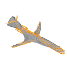

# Pixel2Mesh++

This is an implementation of the ICCV'19 paper "Pixel2Mesh++: Multi-View 3D Mesh Generation via Deformation".

Our method takes multi-view images as input and the network outputs a refined 3D mesh model via deformation.

Please check our [paper](https://arxiv.org/abs/1908.01491) and the [project webpage](https://walsvid.github.io/Pixel2MeshPlusPlus) for more details.

If you have any question, please contact Chao Wen (cwen18 at fudan dot edu dot cn).

#### Citation

If you use this code for any purpose, please consider citing:

```
@inProceedings{wen2019pixel2mesh++,
  title={Pixel2Mesh++: Multi-View 3D Mesh Generation via Deformation},
  author={Chao Wen and Yinda Zhang and Zhuwen Li and Yanwei Fu},
  booktitle={ICCV},
  year={2019}
}
```

## Dependencies

Requirements:

- Python3.6
- numpy
- Tensorflow==1.12.0
- tflearn==0.3.2
- opencv-python
- pyyaml
- scipy

Our code has been tested with Python 3.6, TensorFlow 1.12.0, CUDA 9.0 on Ubuntu 16.04.

## Compile CUDA-op

If you use Chamfer Distance for training or evaluation, we have included the cuda implementations of [Fan et. al.](https://github.com/fanhqme/PointSetGeneration) in `external/`.

We recommend readers to follow the official tutorial of Tensorflow for how to compile the CUDA code. Please refer to [official tutorial](https://www.tensorflow.org/guide/extend/op#gpu_support).

*Addition from author's first documentation*

The official tutorial's link doesn't work anymore. I've followed [this link instead](https://www.tensorflow.org/guide/create_op).

The `make` command didn't work for me. I had to modify it to compile the code for another CUDA version (10 in my case). I've added archives for the original .so and .cu.o files. There are also changes inside the Makefile file you'll need to look into if you want to compile your own version.

In order to make things work, copy the content from the archive of your CUDA version into the `external` folder.

## Dataset

We used the [ShapeNet](https://www.shapenet.org/) dataset for 3D models, and rendered views from [3D-R2N2](https://github.com/chrischoy/3D-R2N2). When using the provided data make sure to respect the shapenet [license](https://shapenet.org/terms).

The training/testing split can be found in `data/train_list.txt` and `data/test_list.txt`.

If you are interested in using our data, please check [`./data`](./data) for terms of usage.

## Pre-trained Model
We provide pre-trained models on ShapeNet datasets. Please check [`./data`](./data) for download links.

## Quick Demo

First, please refer to the documentation in [`./data`](./data) to download the pre-trained model.

Then, execute the script below, the input images for demo has placed in `data/demo/` and the final mesh will be output to `data/demo/predict.obj`:  

```
python demo.py
```

#### Input images, coarse shape and shape generated by pixel2mesh++

    

## Training

Our released code consists of a coarse shape generation and the refined block.

For training, you should first train the coarse shape generation network, then generate intermediate results, and finally train the multi-view deformation network.

#### Step1
For training coarse shape generation, please set your own configuration in `cfgs/mvp2m.yaml`. Specifically, the meaning of the setting items is as follows. For more details, please refer to `modulles/config.py`.

- `train_file_path`: the path of your own train split file which contains training data name for each instance
- `train_image_path`: input image path
- `train_data_path`: ground-truth model path
- `coarse_result_***`: the configuration items related to the coarse intermediate mesh should be same as the training data

Then execute the script:
```
python train_mvp2m.py -f cfgs/mvp2m.yaml
```

#### Step2
Before training multi-view deformation network, you should generated coarse intermediate mesh.

```
python generate_mvp2m_intermediate.py -f cfgs/mvp2m.yaml
```

#### Step3
For training multi-view deformation network, please set your own configuration in `cfgs/p2mpp.yaml`.

The configuration item is similar to Step1. In particular, `train_mesh_root` should be set to the output path of intermediate coarse shape generation.
Then execute the script:

```
python train_p2mpp.py -f cfgs/p2mpp.yaml
```

## Evaluation

First, download the pre-trained model from the link in [`./data`](./data). 

Then the model can output predict mesh as follows.

#### Step 1
Generate coarse shape, you also need to set your own configuration in `cfgs/mvp2m.yaml` as mentioned previously, then execute the script:
```
python test_mvp2m.py -f cfgs/mvp2m.yaml
```

#### Step2
You should set `test_mesh_root` in `cfgs/p2mpp.yaml` to the output folder in step1 and `test_image_path`,`test_file_path` as it mentioned in Training step.

Then execute the script:
```
python test_p2mpp.py -f cfgs/p2mpp.yaml
```

For evaluate F-score and Chamfer distance you can execute the script below, and the evaluation result will be output and stored in `result/refine_p2mpp/log`:
```
python f_score.py -f cfgs/p2mpp.yaml
python cd_distance.py -f cfgs/p2mpp.yaml
```

Please check that you config the correct ground truth path, image path and test split file path in yaml config file.

Due to the stochastic nature during training. The released pre-trained model has slightly better F-score 67.23, CD 0.381 compared to F-score 66.48, CD 0.486 in the paper.

## Statement

This software is for research purpose only. 
Please contact us for the licence of commercial purposes. All rights are preserved.

## License

BSD 3-Clause License
